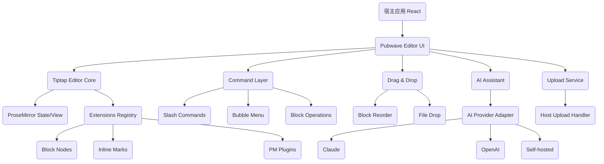

<!--
Sync Impact Report

- Version change: 1.1.0 → 1.1.1
- Modified sections:
	- 4.1.2 验收标准：移除 undo/redo 要求
	- 4.1.2 创建：换行仅使用 Enter（移除 Shift+Enter）
	- 4.3.3 拖动后的体验：移除 undo/redo/撤销重做要求
	- 4.4.2 AI 交互：移除 Floating Menu 触发
	- 4.5.2 格式化工具栏：明确仅在选区存在时显示（上下文工具栏）
	- 3.2/3.3/6/7/4.9：同步移除 Floating Menu 与撤销相关表述
- Templates requiring updates: None
- Deferred TODOs:
	- TODO(RATIFICATION_DATE): 初次采纳日期未知，需要维护者补充
-->

# Pubwave Editor Constitution

## Core Principles

### 块级优先与直觉交互
Pubwave Editor 的核心交互单位是“块（Block）”。所有编辑、选择、拖拽、转换、复制粘贴都
MUST 围绕块模型实现，并在用户感知上保持一致：

- MUST 支持段落/标题/列表/引用/代码块/媒体/表格/分割线等块级内容的创建、选择、移动、转换。
- MUST 保证光标与焦点行为可预测：Enter/Backspace/Arrow 的表现与 Notion 类编辑器一致。
- MUST 允许“块内编辑 + 块间编排”的连续流体验，不引入割裂的模式切换。

Rationale: 块级模型是 Notion 风格的可理解性与可组合性的根基。

### 集成优先：API 与可嵌入性
Pubwave Editor 是开源可集成编辑器。对外可用性与可嵌入性是第一等需求：

- MUST 提供清晰稳定的 TypeScript API（内容、格式、块、事件、AI、上传）。
- MUST 支持“可插拔 Provider”：AI、上传、存储、主题、扩展注册等都以接口注入。
- SHOULD 提供 headless 能力（核心逻辑与 UI 解耦）以便在不同产品中复用。
- MUST 对外暴露可控的配置面（EditorConfig），并保持向后兼容为默认策略。

Rationale: 开源项目的成功取决于集成成本与可扩展边界是否清晰。

### 可扩展为默认：节点/标记/插件
编辑器 MUST 以扩展系统为中心组织功能，而不是把功能“写死在核心里”：

- MUST 以 Tiptap Extension 为基础实现块（Node）与内联格式（Mark）。
- MUST 定义扩展生命周期（注册、配置、启用/禁用、销毁）与冲突策略（schema/快捷键/命令）。
- MUST 提供“最小扩展开发指南”：如何新增 Node/Mark、如何注入命令、如何定义属性与解析规则。

Rationale: 富文本系统的长期演进依赖扩展边界与 schema 管理。

### 性能与稳定性红线
Pubwave Editor 面向大文档与企业级稳定性，性能与可靠性不是“优化项”，而是硬约束：

- MUST 为关键路径定义性能预算（首屏、输入延迟、大文档滚动、内存占用）。
- MUST 具备崩溃恢复与错误隔离策略（扩展崩溃不影响核心编辑）。
- MUST 对异步能力（上传、AI 流式输出）做取消、超时、重试与错误提示。

Rationale: 编辑器是高频交互组件，性能与稳定性直接决定可用性。

### AI 可选、安全、可观测
AI 是增强能力而不是前置依赖：

- MUST 支持在不启用 AI 的情况下完整使用编辑器（ai.enabled=false）。
- MUST 将 AI Provider 抽象为接口（Claude/GPT/自托管），并支持运行时切换。
- MUST 明确上下文边界：默认仅发送用户显式选区/当前块/可配置窗口，不得隐式外传敏感数据。
- MUST 对 AI 请求提供可观测性（事件、耗时、错误码、速率限制触发）。

Rationale: AI 的合规与成本不可忽略，必须可控、可替换、可禁用。

## 产品规格

### 1. 文档头部

- 产品名称：Pubwave Editor
- 文档类型：产品宪法（Product Constitution）
- 文档目的：定义 Pubwave Editor 的不可妥协原则、端到端功能规格、API 契约与交付门禁，
	用于指导开发、评审、测试与对外集成。
- 文档范围：编辑器核心（块/格式/命令/拖拽/媒体/扩展/性能/UX）与对外 API；
	不包含上层业务系统（账号、权限、后端内容服务）。
- 维护者：Pubwave Editor Maintainers（开源维护团队）
- 更新策略：任何破坏性更改 MUST 伴随版本升级、迁移说明与兼容策略。

### 2. 执行摘要

Pubwave Editor 是基于 Tiptap/ProseMirror 的 Notion 风格块级富文本编辑器，目标是在 Web
应用中提供“所见即所得 + 块级编排”的直觉体验，并以最小集成成本让开发者快速嵌入。

它同时提供可插拔的 AI 辅助写作能力：从选区或当前块生成内容、改写润色、总结翻译、
以及 Copilot 风格自动补全。AI 不是硬依赖，默认可完全关闭，且通过 Provider 抽象支持
Claude / OpenAI / 自托管模型。

核心价值主张：

- 所见即所得的块级编辑体验（创建/选择/拖拽/转换一致）
- AI 驱动的智能写作助手（流式输出、可控上下文、可替换 Provider）
- 开源可扩展架构（Extension/Node/Mark/Plugin）
- 企业级性能与稳定性（预算、容错、恢复）

目标用户与场景：

- 开发者：希望在产品中快速集成“Notion 风格编辑器”的团队
- 内容创作：笔记、文档、知识库、项目规划
- 协作文档：与外部协作系统集成（本宪法定义编辑器侧契约，不定义协作后端）

### 3. 技术架构

#### 3.1 技术栈清单

- UI 框架：React
- 编辑器框架：Tiptap
- 编辑器内核：ProseMirror
- AI 集成：Claude API / OpenAI / 自定义 Provider
- 样式方案：Tailwind CSS（由宿主应用提供主题与 token）

#### 3.2 架构图（Mermaid）



#### 3.3 模块结构（建议）

- `core/`：Tiptap 初始化、Extension 注册、命令层、schema 管理
- `ui/`：菜单、工具栏（选区时显示）、拖拽手柄、气泡菜单
- `services/`：AI Provider、上传服务、遥测/日志（可选）
- `types/`：对外 TypeScript 类型定义（EditorConfig、EditorAPI 等）

#### 3.4 数据流设计

- 用户输入（键盘/鼠标/触摸）→ Tiptap Command → ProseMirror Transaction → State 更新
- UI 订阅 `onUpdate/onSelectionUpdate` → 更新菜单/手柄/工具栏状态
- 上传：File → `upload.handler(file)` → URL → 写入 Node attrs → 触发渲染
- AI：上下文组装 → `ai.provider.generate()`（流式）→ 增量插入/替换 → 用户 accept/reject

### 4. 功能规格

本节每个模块包含：功能描述、用户故事、交互规范、技术实现要点、验收标准。

#### 4.1 块级编辑系统

##### 4.1.1 块节点类型清单

说明：下表以“块”为单位描述最小可用集合；扩展块通过 Extension 机制新增。

| 块类型 | 功能描述 | 创建方式（快捷键/斜杠） | 允许内容类型 | 配置项（attrs） | 交互行为 |
|---|---|---|---|---|---|
| 段落 Paragraph | 默认文本块 | Enter 新行；`/paragraph` | inline（text/marks） | `placeholder?` | 普通输入；Enter 生成新段落 |
| 标题 Heading | H1-H6 标题 | `# `→H1；`## `→H2；`/h1`… | inline | `level:1-6` | Enter 创建段落；Backspace 在空标题降级/转段落 |
| 无序列表 Bullet List | 项目符号列表 | `- ` 或 `* `；`/bullet` | listItem（paragraph） | `tight?` | Tab/Shift+Tab 缩进/反缩进 |
| 有序列表 Ordered List | 编号列表 | `1. `；`/numbered` | listItem | `start:number` | 同上 |
| 任务列表 Task List | 勾选任务 | `[] `；`/todo` | taskItem（paragraph） | `checked:boolean` | 点击 checkbox 切换；Enter 新任务 |
| 引用 Quote | 引用块 | `> `；`/quote` | inline / paragraph | `citation?` | Enter 空引用→退出成段落 |
| Callout 提示块 | 强调信息块 | `/callout` | inline / paragraph | `emoji?` `tone?` | 左侧标识；Enter 行为同引用 |
| 代码块 Code Block | 等宽代码 | ```；`/code` | text（no marks, optional） | `language:string` | Tab 插入缩进；Enter 保持块内 |
| 分割线 Divider | 视觉分隔 | `---`；`/divider` | none | none | 选中时表现为块；上下移动可跨越 |
| 图片 Image | 图片展示 | `/image`；拖放文件；粘贴图片 | none | `src` `alt?` `caption?` `width?` `align?` | 点击选中；拖拽调宽（可选）；双击编辑说明 |
| 视频 Video | 视频/嵌入 | `/video`；粘贴 URL | none | `src` `provider?` `ratio?` | 选中后显示播放器控制 |
| 文件附件 File | 附件下载/预览 | `/file`；拖放文件 | none | `src` `name` `size?` `mime?` | 点击下载/打开；显示上传进度 |
| 表格 Table | 结构化表格 | `/table` | tableRow/tableCell | `rows` `cols` `withHeader?` | Tab 移动单元格；Enter 换行 |
| 嵌入 Embed | 外部内容嵌入 | `/embed`；粘贴可识别 URL | none | `src` `kind` | 选中后显示链接与刷新 |

边界与兼容：

- MUST 支持 HTML/Markdown（可配置）导入导出；至少保证常见块可往返。
- SHOULD 为未知块提供降级策略（例如渲染为“UnsupportedBlock”占位）。

##### 4.1.2 块操作规范（生命周期）

创建：

- Enter：在块末尾创建新段落块；在列表/任务项中创建同类型下一项。
- 换行：仅使用 Enter。
- `/`：触发斜杠菜单，选择块类型或动作后执行。
- 拖放：拖入文件 → 创建媒体/附件块；拖入纯文本/HTML → 粘贴规则处理。

选择：

- 单选：点击块左侧手柄/块外框（或块内容区的“块边界”）选中整块。
- 多选：Shift+点击扩大范围；或拖拽框选（若实现）
- 全选：Cmd/Ctrl+A：优先选中文档内容；再次触发可选择全块（实现可选）。

编辑：

- 焦点管理 MUST 可预测：
	- 点击块内容→进入文本光标
	- 点击手柄→块选中态（Selection 为 NodeSelection 或 TextSelection 边界）
- 光标行为：上下箭头跨块移动时，尽量保持列/offset（典型 PM 行为）。

删除：

- Backspace 在块起始：
	- 若前一块可合并：合并到前一块末尾
	- 若当前为“可降级块”（如标题/引用/列表项）：空内容时先降级，再删除
	- 对媒体块：选中态 Backspace/Delete 删除整块

转换：

- MUST 支持块类型转换（/turn into 或斜杠菜单）：
	- 文本类块（段落/标题/引用/Callout）之间互转
	- 列表项在 bullet/ordered/task 间互转（尽量保留内容）
	- 代码块转换为段落时保留文本并去除语法高亮 attrs

移动：

- 拖拽排序：通过手柄拖拽改变块顺序；多选拖拽时整体移动。
- 复制粘贴：
	- 块选中态 Cmd/Ctrl+C 复制块（包含 attrs）
	- 粘贴到空行：按块插入；粘贴到块内：按解析规则转换为 inline 或 split block

技术实现要点：

- 块 ID：SHOULD 为每个块分配稳定 `id`（attr），用于拖拽、多选、外部定位与协作。
- 命令层：统一通过 Tiptap commands 派发，避免 UI 直接操作 PM state。

验收标准：

- 块创建/选择/删除/转换/移动行为一致，且焦点/光标无异常跳跃。
- 典型 Notion 交互（Enter/Backspace/Tab/Shift+Tab/Arrow）符合预期，无光标跳跃。

#### 4.2 斜杠命令系统

##### 4.2.1 命令菜单

触发方式：

- MUST 在可编辑文本块中输入 `/` 触发。
- MUST 支持在行首与行内触发；行首触发时优先作为“插入块/转换块”。
- MUST 在用户输入非命令上下文（如代码块）时可配置禁用。

UI 设计：

- 菜单由分组 + 图标 + 主标题 + 描述组成。
- MUST 支持键盘导航；鼠标悬停高亮。
- 分组建议：基础块、列表、媒体、表格、AI、操作（转换/删除/复制链接等）。

搜索与过滤：

- 输入 `/` 后继续输入作为过滤关键字。
- MUST 同时匹配：命令名、别名、描述。

##### 4.2.2 命令清单（示例最小集）

| 命令 | 别名 | 描述 | 执行效果 | 快捷键提示 | 可用条件 |
|---|---|---|---|---|---|
| /paragraph | /p | 段落 | 转换/插入段落 |  | 可编辑文本块 |
| /h1.. /h6 | /title | 标题 | 转换为指定级别标题 | `Cmd/Ctrl+Alt+1..6`（可选） | 文本类块 |
| /bullet | /ul | 无序列表 | 转换为 bullet list | `Cmd/Ctrl+Shift+8`（可选） | 文本类块 |
| /numbered | /ol | 有序列表 | 转换为 ordered list | `Cmd/Ctrl+Shift+7`（可选） | 文本类块 |
| /todo | /task | 任务列表 | 转换为 task list |  | 文本类块 |
| /quote |  | 引用 | 转换为 quote |  | 文本类块 |
| /callout |  | 提示块 | 插入 callout |  | 文本类块 |
| /code |  | 代码块 | 转换为 code block |  | 文本类块 |
| /divider | /hr | 分割线 | 插入 divider |  | 任意位置 |
| /table |  | 表格 | 插入 2x2 表格（可配置） |  | 任意位置 |
| /image | /img | 图片 | 触发选择文件/URL 插入图片块 |  | 上传可用 |
| /video |  | 视频 | 插入视频/嵌入 |  | 允许嵌入 |
| /file | /attach | 附件 | 插入文件附件块 |  | 上传可用 |
| /ai |  | AI 菜单 | 打开 AI 子菜单 | `Cmd/Ctrl+J`（可选） | ai.enabled=true |
| /ai-continue |  | 继续写作 | 从光标处继续生成 |  | ai.enabled=true |
| /ai-improve |  | 润色 | 对选区/当前块润色 |  | ai.enabled=true |
| /ai-summarize |  | 总结 | 总结选区/当前块 |  | ai.enabled=true |
| /ai-translate |  | 翻译 | 翻译选区/当前块 |  | ai.enabled=true |

##### 4.2.3 键盘导航

- Up/Down：移动高亮项
- Enter：执行高亮项
- Escape：关闭菜单并恢复原输入
- Tab：若存在二级菜单/参数输入，则进入参数；否则等同 Enter（实现可选）

技术实现要点：

- 菜单状态与过滤逻辑 MUST 与 ProseMirror selection 同步。
- 执行命令时 MUST 处理“替换 `/query` 文本”与“插入块”的事务一致性。

验收标准：

- `/` 菜单响应 < 50ms（本地过滤）。
- 键盘全流程可用，不需要鼠标。

#### 4.3 拖拽交互系统

##### 4.3.1 拖拽手柄

- 显示位置：块左侧（与 Notion 类似），在 hover/光标进入块区域时出现。
- 显示时机：
	- MUST 在块处于可操作状态时显示（例如：编辑器可编辑、非只读、非禁用块）。
	- SHOULD 在块被选中时保持可见，避免用户“失去抓手”。
- 外观：使用宿主 Tailwind token；不得硬编码新颜色。
- 命中区域：手柄点击/拖拽区域 MUST 足够大以便鼠标与触摸操作（避免像素级命中）。
- 点击行为：进入块选中态；可弹出上下文菜单（复制、删除、转换、移动到…）。
- 拖拽起手：
	- MUST 采用“按下并移动超过阈值”才开始拖拽的策略，避免误触（阈值由实现定义）。
	- 开始拖拽后，指针样式 SHOULD 变为 grabbing，明确“已进入拖拽模式”。
- 多选：当存在多选时，手柄拖拽移动整组。

##### 4.3.2 拖放行为

- 可拖拽块：除“文档根”外的所有块类型。
- 放置目标：块与块之间；列表嵌套遵循 schema（Tab/Shift+Tab 亦可）。
- 拖拽开始（Drag Start）：
	- MUST 将被拖拽块（或多选块组）置为“拖拽中”状态，并保留其原位置的占位符，
		防止文档整体跳动导致用户迷失。
	- MUST 将当前拖拽对象序列化为内部 payload（至少包含 blockId 列表 + 原始顺序）。
- 拖拽过程（Drag Over / During Drag）：
	- 视觉反馈 MUST 同时包含：
		- 拖拽预览：跟随指针的块摘要（标题/首行/媒体缩略）；多选时显示“数量 + 首块摘要”。
		- 放置指示器：明确的插入线或占位框，指示最终落点（before/after 哪个块）。
	- 可放置性反馈：
		- 当目标位置违反 schema/规则时，指示器 MUST 呈现“不可放置”状态（例如禁用样式），
			且释放鼠标 MUST 不改变文档。
	- 自动滚动（Auto-scroll）：
		- 当指针接近编辑区域上下边缘时，SHOULD 自动滚动，以支持长文档拖动。
		- 自动滚动速度 SHOULD 与靠近边缘距离相关（线性或分段皆可）。
	- 拖拽取消：
		- Escape MUST 取消拖拽并还原到拖拽开始前的文档状态（含选中态）。
		- 在编辑区域外释放鼠标/触摸（或系统取消）MUST 视为取消，不得产生半成品状态。
- 嵌套规则：
	- 列表项可嵌套
	- 表格内部拖拽默认禁用或限定为单元格选择（实现可选）
- 跨文档拖拽：可选；若实现 MUST 以序列化块数据为 payload，并做安全校验。

##### 4.3.3 拖动后的体验（Drop / After Drop）

- 落点确认：释放后 MUST 以一次原子事务（single transaction / atomic update）完成块移动，
	确保不会产生中间态或半成品状态。
- 动画与稳定性：
	- SHOULD 对“占位符消失 + 块落位”提供轻量过渡（不引入花哨动画），帮助用户建立空间映射。
	- MUST 避免落位后页面突跳（scroll jump）。若因为自动滚动导致视口变化，落位后视口
		SHOULD 保持拖拽对象仍可见（至少一部分可见）。
- 选中与焦点（非常关键）：
	- 单块拖拽完成后：
		- MUST 保持该块处于选中态；若拖拽前是文本光标态，可配置为恢复到块内最近光标位置。
	- 多选拖拽完成后：
		- MUST 保持整组仍为多选状态（同一组 blockId），便于连续移动/删除/转换。
	- 无论单选或多选：拖拽完成后 MUST 能立即继续键盘操作（Arrow/Backspace/Enter）。
- 失败处理：
	- 若在 drop 时发现目标无效（规则变化/并发更新/宿主拦截），MUST 回退并给出可读提示
		（例如 toast 或 inline 提示），不得静默失败。

##### 4.3.4 文件拖放

- 支持文件类型：图片（png/jpg/webp/gif）、视频（mp4/webm）、通用附件（pdf/docx/zip 等）。
- 上传流程：
	1) drop 捕获 File 列表
	2) 立即插入“上传中占位块”（带进度）
	3) 调用 `upload.handler(file)` 获取 URL
	4) 成功：更新占位块 attrs；失败：占位块显示错误并允许重试
- 进度显示：若 `upload.handler` 支持进度回调，可展示；否则显示 indeterminate。
- 错误处理：大小超限、类型不支持、网络失败、服务端拒绝。

验收标准：

- 拖拽排序不丢失内容与 attrs，且落位位置与指示器一致。
- 拖拽过程中：占位符稳定、可取消（Esc/释放到编辑区外）、自动滚动可用。
- 拖拽完成后：选中态/焦点符合规范，且可立即继续键盘操作。
- 文件拖放失败时用户能理解原因并可重试。

#### 4.4 AI 辅助系统

##### 4.4.1 AI 能力

- 内容生成：继续写作、从提示生成、扩写/缩写
- 内容优化：润色、语法修正、风格统一
- 总结与转换：总结、要点提取、翻译
- 自动补全：Copilot 风格建议（可选，默认关闭）
- 智能建议：标题建议、行动项提取（可选）

##### 4.4.2 AI 交互

- 触发方式：
	- 选中文本 → Bubble Menu 出现 AI 按钮
	- 空行/块起始 → `/ai`
	- 快捷键（可配置）：`Cmd/Ctrl+J` 打开 AI 菜单
- 流式输出：
	- MUST 支持逐 token/逐 chunk 更新
	- MUST 在生成期间允许取消（AbortController）
- 接受/拒绝：
	- 接受：将 AI 输出写入文档（插入或替换选区）
	- 拒绝：丢弃输出，不修改文档
- 加载状态：显示生成中、速率限制、错误原因（可读文案）

##### 4.4.3 AI 集成

- Provider 选择：Claude/GPT/自托管，统一接口：

```ts
export type AIProviderId = 'claude' | 'openai' | 'custom'

export interface AIRequestContext {
	selectionText?: string
	currentBlockText?: string
	surroundingText?: string
	userPrompt?: string
	locale?: string
}

export interface AIStreamChunk {
	textDelta: string
	done?: boolean
}

export interface AIProvider {
	id: AIProviderId | string
	generateStream(ctx: AIRequestContext, options?: { signal?: AbortSignal }): AsyncIterable<AIStreamChunk>
}
```

- Prompt 工程策略：
	- MUST 由宿主可配置系统提示词（system prompt）与风格参数
	- SHOULD 内置最小模板（继续写作/润色/总结/翻译）
- 上下文管理：
	- 默认仅使用“选区 + 当前块 + 可配置窗口”的文本
	- MUST 支持宿主注入额外上下文（例如文档标题、用户偏好），并标注来源
- 速率限制与配额：
	- MUST 在 UI 层提示“达到速率/配额”
	- SHOULD 提供退避重试（exponential backoff）

验收标准：

- AI 关闭时不加载 Provider 相关依赖（按需加载优先）。
- AI 生成可取消，取消后文档不应进入不一致状态。

#### 4.5 格式化系统

##### 4.5.1 内联格式（Marks）

- 基础：粗体、斜体、下划线、删除线、行内代码
- 颜色与高亮：文本颜色、背景高亮（通过 theme token 映射）
- 链接：创建、编辑、预览（hover tooltip 可选）
- 自定义标记扩展：允许宿主新增 mark（如 mention、tag）

##### 4.5.2 格式化工具栏

- 工具栏形态：上下文工具栏（Bubble Menu）。
	- MUST 仅在选区存在（用户选中内容）时显示。
	- 当选区为空（仅光标）时 MUST 不显示工具栏。
	- 内容与按钮：提供常用格式与 AI 入口。
- 快捷键映射：
	- Bold: `Cmd/Ctrl+B`
	- Italic: `Cmd/Ctrl+I`
	- Underline: `Cmd/Ctrl+U`（可选）
	- Code: `Cmd/Ctrl+E`（可选）
	- Link: `Cmd/Ctrl+K`

##### 4.5.3 样式系统

- 主题支持：亮/暗由宿主控制（class 或 CSS variables）
- 自定义颜色面板：颜色列表由宿主配置（不在核心硬编码）
- 字体与尺寸：遵循宿主排版；编辑器仅暴露 className/slot
- CSS 架构：Tailwind utility + 最少必要的组件样式；避免全局污染

验收标准：

- 不同主题下可读性满足 WCAG 对比度建议（由宿主 token 保证）。
- 快捷键与按钮状态与 selection 同步。

#### 4.6 媒体处理系统

##### 4.6.1 图片

- 上传方式：本地选择、URL、拖放、粘贴
- 尺寸调整：拖拽手柄（可选）与数值输入（可选）；必须保持 aspect ratio 选项
- 对齐：left/center/right
- Alt 文本与说明：支持 `alt` 与 `caption`
- 压缩与优化：
	- SHOULD 允许宿主在上传前处理（压缩/转 webp）
	- MUST 支持最大尺寸限制与错误提示

##### 4.6.2 视频

- 嵌入：YouTube/Vimeo URL（识别并转换为 embed）
- 本地：通过上传得到可播放 URL
- 响应式：支持固定比例（16:9 默认）

##### 4.6.3 文件附件

- 支持类型：不做强限制但可由宿主白名单控制
- 预览：对 pdf/图片可选内嵌预览；默认提供下载链接

##### 4.6.4 存储策略

- 本地 vs 云：编辑器不内置存储，依赖 `upload.handler` 返回可访问 URL
- CDN：由宿主配置；编辑器仅消费 URL
- 安全：
	- MUST 防止 XSS（对 HTML 导入/粘贴做 sanitize，或限制为安全子集）
	- MUST 对外链资源展示来源并允许宿主拦截

验收标准：

- 上传失败可重试；成功后 URL 正确写入节点 attrs。
- 粘贴/拖放外链图片可配置为“直接引用”或“下载后上传”。

#### 4.7 扩展性架构

##### 4.7.1 扩展系统

Node 开发指南（最小要求）：

- MUST 定义 schema（name, group, content, attrs）与 parse/render 规则
- MUST 提供 commands（insert/convert）与 keyboard shortcuts（如适用）
- SHOULD 提供 node view（复杂 UI，如图片调整）

Mark 开发指南（最小要求）：

- MUST 定义 attrs（如 link href）与 parse/render
- MUST 提供 toggle/set/unset commands

插件机制：

- PM Plugin 用于：拖拽装饰、菜单定位、输入规则、粘贴规则
- 生命周期：注册 → init → update → destroy

##### 4.7.2 配置系统（对外接口）

```ts
import type { Extension } from '@tiptap/core'

export interface EditorConfig {
	// 基础配置
	editable: boolean
	autofocus: boolean | 'start' | 'end'
	placeholder: string

	// 扩展配置
	extensions: Extension[]

	// AI 配置
	ai?: {
		enabled: boolean
		provider: string
		apiKey?: string
		providerImpl?: unknown
	}

	// 上传配置
	upload?: {
		handler: (file: File) => Promise<string>
		maxSize: number
		accept?: string[]
	}
}
```

##### 4.7.3 API 设计（对外暴露）

内容操作：

- `getContent()`：返回 JSON（ProseMirror/Tiptap）或宿主指定格式
- `setContent(content)`：设置内容
- `clearContent()`：清空

格式化命令：

- `toggleBold()`、`toggleItalic()`、`toggleCode()`
- `setHeading(level)`

块操作：

- `insertBlock(type, attrs, position?)`
- `deleteBlock(blockId)`
- `moveBlock(blockId, targetIndex | beforeBlockId)`

AI API：

- `generateContent(options)`
- `improveText(options)`

事件系统：

- `onUpdate(cb)`
- `onSelectionUpdate(cb)`

验收标准：

- 宿主仅通过 API 即可完成常见集成：初始化、内容读写、监听变化、上传、AI。

#### 4.8 性能与优化

##### 4.8.1 性能指标（目标）

- 首次加载：核心 bundle 与首屏交互可用在 2s 内（取决于宿主网络/缓存）
- 输入响应：普通输入 p95 < 16ms（单帧）
- 大文档：1 万行文本/上百块媒体时仍可编辑（滚动与输入不明显卡顿）
- 内存：避免无界增长（插件装饰、历史栈、媒体预览）

##### 4.8.2 优化策略

- 虚拟滚动：对超长文档可选（需要与 PM view 协调，谨慎启用）
- 懒加载扩展：AI、媒体编辑、语法高亮等按需加载
- 防抖节流：selection 监听、遥测、保存触发
- 增量渲染：避免频繁重建 editor view
- Web Worker：可用于 markdown 转换、图片压缩（由宿主提供更佳）

验收标准：

- 在设定的基准文档上完成性能回归测试（由维护者定义基准）。

#### 4.9 用户体验

##### 4.9.1 响应式设计

- 桌面：上下文工具栏（选区时显示）/拖拽手柄
- 平板：支持触摸选择与拖拽（可降级为“移动上下按钮”）
- 移动：优先保证输入与基础格式；复杂拖拽可降级

##### 4.9.2 无障碍性

- MUST 支持键盘完整导航（Slash 菜单、工具栏、块选择与移动）
- MUST 为菜单/按钮提供 ARIA label
- SHOULD 满足可读性与对比度（由宿主主题保证）

##### 4.9.3 错误处理

- 网络错误：上传/AI 失败可重试，展示原因
- 数据校验：内容导入/粘贴失败提供降级提示
- 崩溃恢复：
	- SHOULD 支持 autosave hook（由宿主实现存储）
	- MUST 确保异常不会导致内容不可恢复（至少保留最近一次成功 state）

### 5. API 规范

#### 5.1 类型定义

```ts
export type ContentFormat = 'json' | 'html' | 'markdown'

export interface GetContentOptions {
	format?: ContentFormat
}

export interface SetContentOptions {
	format?: ContentFormat
	emitUpdate?: boolean
}

export interface EditorAPI {
	getContent(options?: GetContentOptions): unknown | string
	setContent(content: unknown | string, options?: SetContentOptions): void
	clearContent(): void

	toggleBold(): void
	toggleItalic(): void
	toggleUnderline(): void
	toggleStrike(): void
	toggleCode(): void
	setHeading(level: 1 | 2 | 3 | 4 | 5 | 6): void
	setLink(href: string): void
	unsetLink(): void

	insertBlock(type: string, attrs?: Record<string, unknown>, position?: 'after' | 'before'): void
	deleteBlock(blockId: string): void
	moveBlock(blockId: string, target: { beforeBlockId?: string; index?: number }): void

	ai?: {
		continueWriting(options?: { signal?: AbortSignal }): Promise<void>
		improveSelection(options?: { signal?: AbortSignal }): Promise<void>
		summarizeSelection(options?: { signal?: AbortSignal }): Promise<void>
	}

	onUpdate(cb: (payload: { docChanged: boolean }) => void): () => void
	onSelectionUpdate(cb: (payload: { empty: boolean }) => void): () => void
}
```

#### 5.2 使用示例

```ts
import { createPubwaveEditor } from 'pubwave-editor'

const editor = createPubwaveEditor({
	editable: true,
	autofocus: 'start',
	placeholder: '开始写作…',
	extensions: [],
	ai: {
		enabled: true,
		provider: 'openai',
	},
	upload: {
		maxSize: 20 * 1024 * 1024,
		handler: async (file) => {
			// host uploads and returns a CDN URL
			return await uploadToCDN(file)
		},
	},
})

editor.onUpdate(() => {
	const content = editor.getContent({ format: 'json' })
	saveDraft(content)
})
```

#### 5.3 错误处理

- API 方法 MUST 抛出可识别错误（或返回 Result），例如：
	- `UPLOAD_MAX_SIZE_EXCEEDED`
	- `AI_RATE_LIMITED`
	- `INVALID_CONTENT_FORMAT`
- UI 层 MUST 将错误转换为用户可读提示，并提供重试/取消。

### 6. 实施路线图

#### Phase 1（MVP）：核心编辑功能（3-5 周）

- 块级编辑：段落/标题/列表/引用/代码块/分割线
- Slash 命令（基础块）
- 基础格式（bold/italic/link）
- 基础拖拽排序（单块）
- 对外 API：get/set/onUpdate

里程碑：可在宿主应用中嵌入并完成“Notion 风格基础文档编辑”。

#### Phase 2（增强）：AI 与富媒体（4-6 周）

- 图片/视频/附件上传与渲染
- AI Provider 抽象 + 流式输出 + accept/reject
- Bubble menu 完整化

里程碑：可用于内容创作与 AI 辅助写作的日常场景。

#### Phase 3（优化）：性能与体验（3-5 周）

- 大文档性能基准与优化（节流、懒加载）
- 无障碍与键盘导航补齐
- 错误恢复与边界行为打磨

里程碑：达到“企业级可用”的稳定体验基线。

#### Phase 4（扩展）：高级功能与插件（持续）

- 扩展开发文档与示例库
- 更多块类型（如 Callout/Embed 细化）、主题与插件生态
- 可选：协作集成适配层（不绑定后端）

### 7. 成功指标

- 用户体验：输入 p95 < 16ms；Slash 菜单响应 < 50ms；常用操作可预测
- 技术指标：崩溃率接近 0；上传/AI 错误可恢复；无明显内存泄漏
- 功能覆盖度：MVP 块与格式覆盖率 100%；富媒体与 AI 覆盖率按阶段达成
- 测试要求：核心交互（Enter/Backspace/Tab/Slash/Drag）具备自动化回归（单测/集成测试均可）

### 8. 未来展望

- 更强的块级能力：多列布局、数据库视图（以扩展形式，避免绑死核心）
- AI：更丰富的上下文策略、离线/本地模型支持
- 生态：官方扩展仓库、示例集成（Next.js/Remix/Vite）

### 9. 参考资源

- Tiptap 文档：https://tiptap.dev/
- ProseMirror 文档：https://prosemirror.net/
- Notion（交互参考）：https://www.notion.so/
- WCAG 无障碍指南：https://www.w3.org/WAI/standards-guidelines/wcag/

## 交付与流程

### 1. 质量门禁（每个 PR 必须检查）

- 核心原则一致性：不得破坏块级交互一致性与可嵌入 API
- 兼容性：对外 API/配置变更必须说明是否 breaking，并遵循版本规则
- 性能预算：新增特性不得显著增加输入延迟与 bundle 体积（AI/媒体应可懒加载）
- 安全：粘贴/导入必须防 XSS；外链嵌入必须可配置拦截
- 无障碍：新增交互必须有键盘路径与 ARIA 标注

### 2. 测试策略

- MUST 为块生命周期关键行为提供回归测试：创建、删除、合并、转换、拖拽移动。
- SHOULD 为 Slash 命令与键盘导航提供集成测试（模拟键盘事件）。
- SHOULD 为上传与 AI 流程提供“可注入 Provider 的测试桩”，覆盖失败/取消/重试。

### 3. 版本与发布

- 版本遵循 SemVer：
	- MAJOR：破坏性 API/内容格式/交互契约变更
	- MINOR：新增向后兼容能力（新块/新 API）
	- PATCH：修复与澄清，不改变对外契约
- Breaking change MUST 提供迁移指南（Migration Notes）。

### 4. 贡献与兼容

- 新增块/mark/plugin MUST 以扩展形式提交，除非能证明属于核心不可或缺能力。
- 宿主样式（Tailwind token、暗色/亮色）必须可配置，不在核心硬编码品牌色。
- 对外集成示例 SHOULD 随发布更新（最少一个 Vite/React 示例）。

## Governance
<!-- Example: Constitution supersedes all other practices; Amendments require documentation, approval, migration plan -->

- 宪法优先级：本宪法高于所有临时约定与实现细节；冲突时以宪法为准。
- 修订流程：
	- 提案：在 PR 中明确“为什么需要修订宪法”（问题、影响范围、替代方案）。
	- 评审：至少 1 名维护者批准；若涉及 breaking change，需额外迁移方案与示例。
	- 生效：合并后更新版本号与 Last Amended 日期。
- 合规检查：所有计划（plan）、规格（spec）、任务（tasks）在开工前 MUST 通过
	“Constitution Check”，宪法文件路径为 `.specify/memory/constitution.md`。
- 版本策略：遵循 SemVer（见“交付与流程 / 版本与发布”）。

**Version**: 1.1.1 | **Ratified**: TODO(RATIFICATION_DATE): 初次采纳日期未知（请维护者补充） | **Last Amended**: 2025-12-20
<!-- Example: Version: 2.1.1 | Ratified: 2025-06-13 | Last Amended: 2025-07-16 -->
